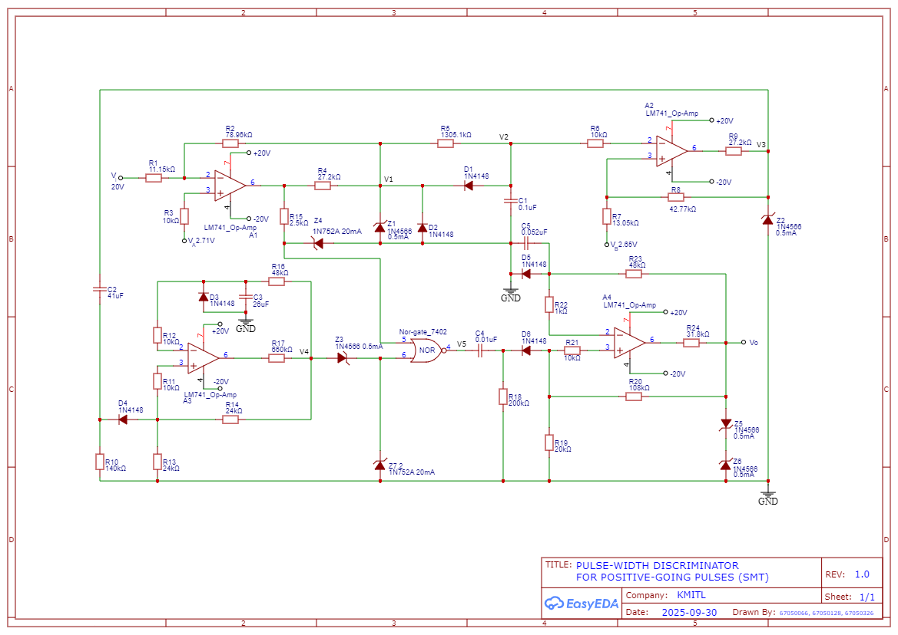
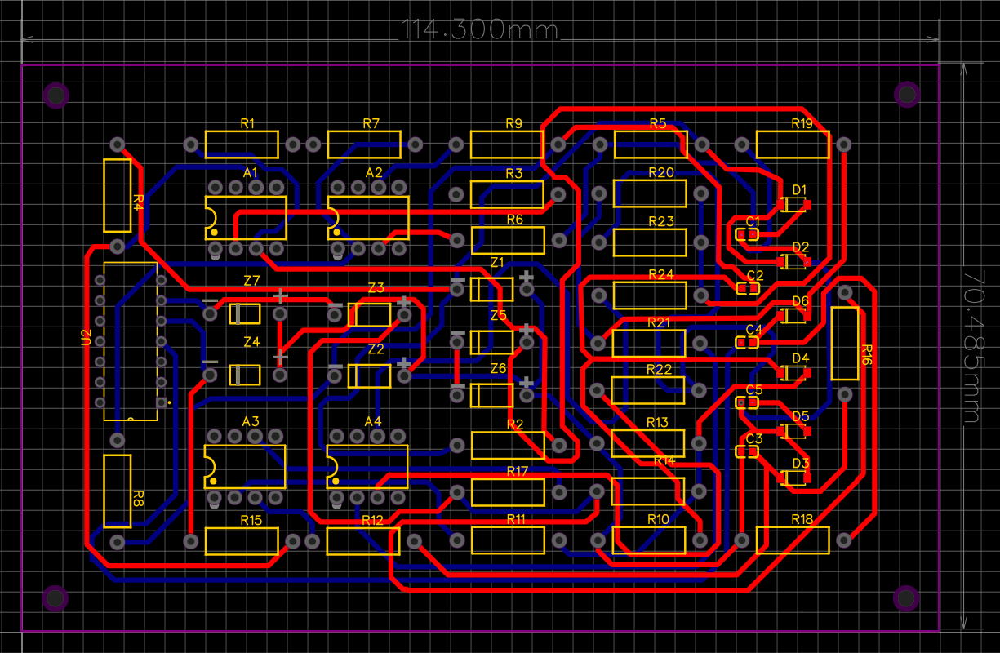
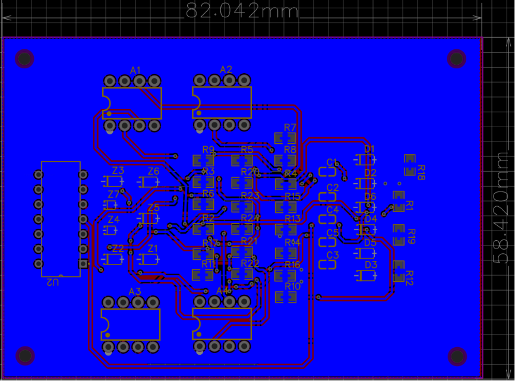
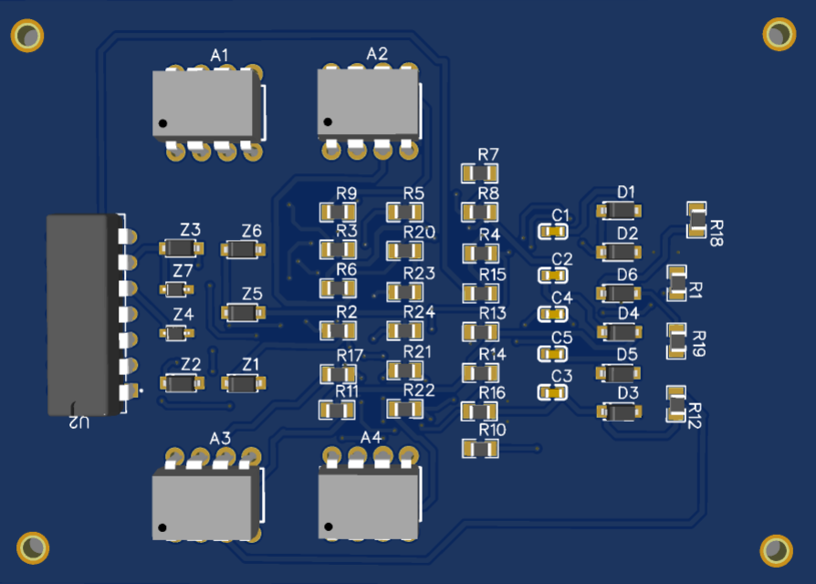
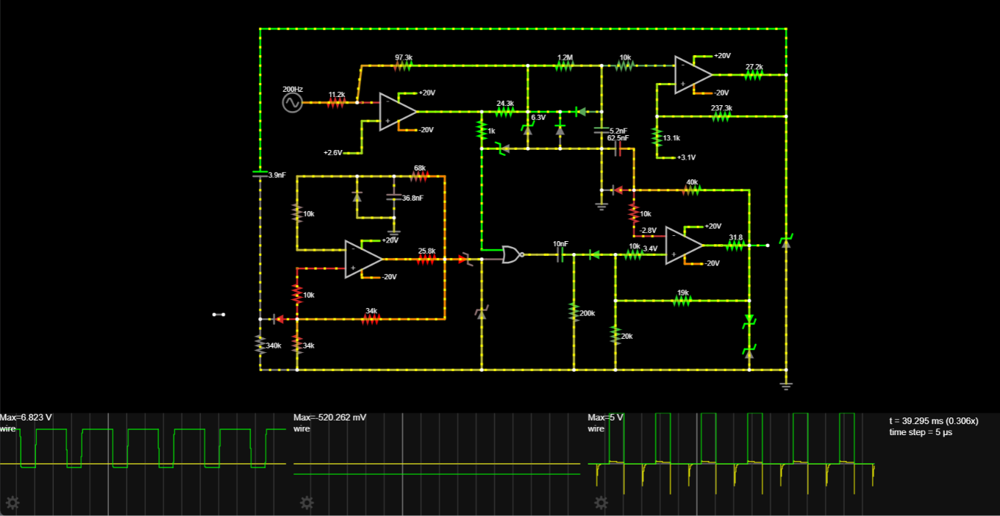

# Design Pulse-Width Discriminator for Positive-Going Pulse
Course KMITL : Electronic Circuit
(Project Electronic Design Circuit)

# PCB Design Design from EasyEDA
ออกแบบวงจรและวาง layout schematic diagram รวมถึงการออกแบบ PCB

# [Positive-Going Pulse Waveform Simulation](https://tinyurl.com/28m83jwr) Simulate from falstad
Simulate Waveform เพื่อดู pulse ว่าได้ตามที่คำนวณไว้หรือไม่ มี logic หรือสัญญาณไฟฟ้าภายในระบบอย่างไร

